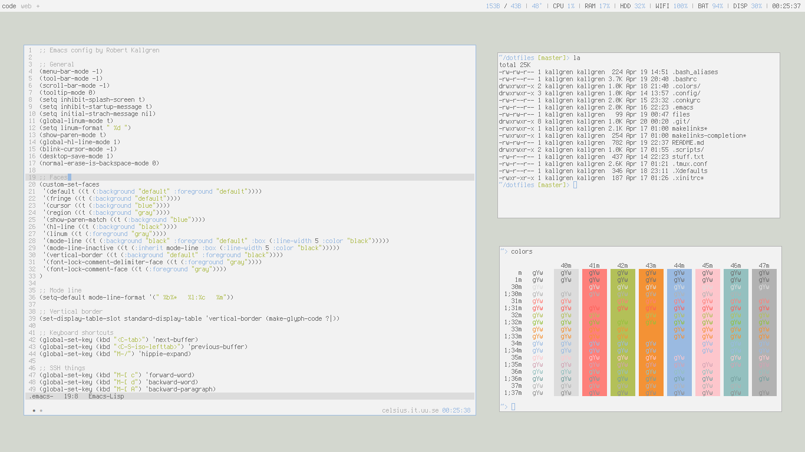

# Kallgren's dotfiles

```bash
> cd ~
> git clone https://github.com/kallgren/dotfiles.git
> dotfiles/bootstrap
```

## Main Applications
* wmfs²
* conky
* urxvt
* tmux
* emacs
* chromium
* scrot


## Screenshots

### Light theme


### Dark theme
Coming soon...
