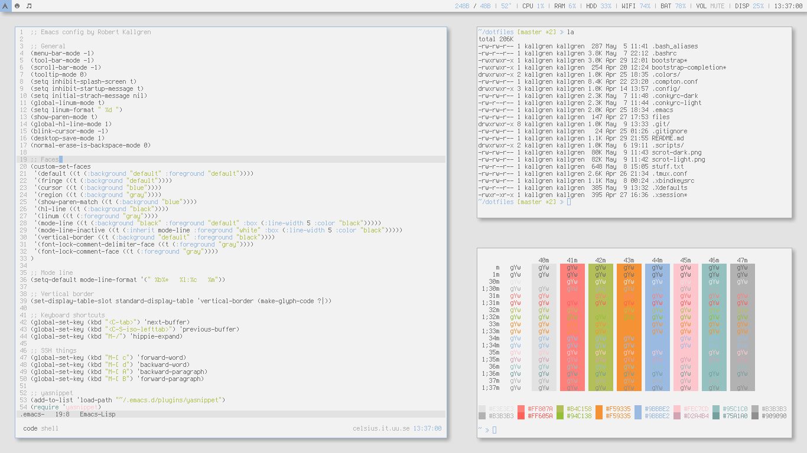

# Kallgren's dotfiles

```bash
> cd ~
> git clone https://github.com/kallgren/dotfiles.git
> dotfiles/bootstrap
```

## Main Applications
* wmfs²
* conky
* urxvt
* tmux
* emacs
* chromium
* git
* scrot


## Screenshots

### Light theme


### Dark theme


## Switching theme

* Change `vanillalight` to `vanilladark` in .Xdefaults include.
* Change `vanillalight-wmfs` to `vanilladark-wmfs` in wmfsrc import.
* Execute `.scripts/statusbar dark` instead of just `.scripts/statusbar`
* `xsetroot -solid "#444444"` instead of `#DDDDDD`

## Credits to
* [TheImmortalPhoenix's WMFS setup](https://raw.githubusercontent.com/wiki/xorg62/wmfs/user-config/screenshots/theimmortalphoenix_20120406.png)
* [The Solarized color scheme philosophy](http://ethanschoonover.com/solarized)
